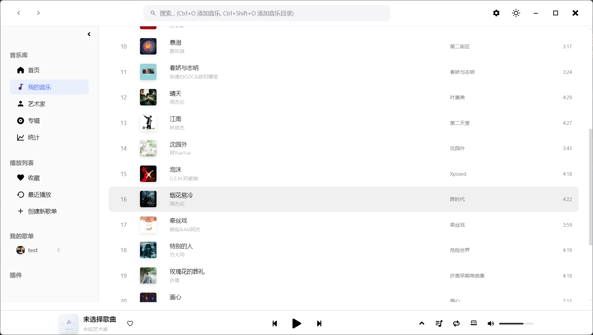
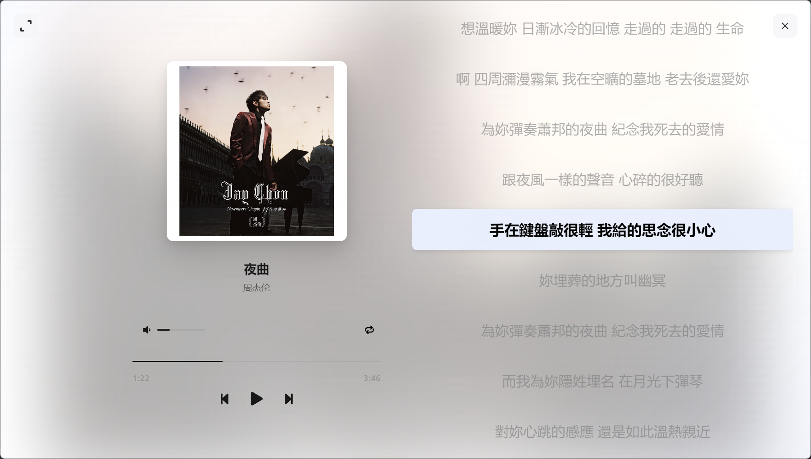
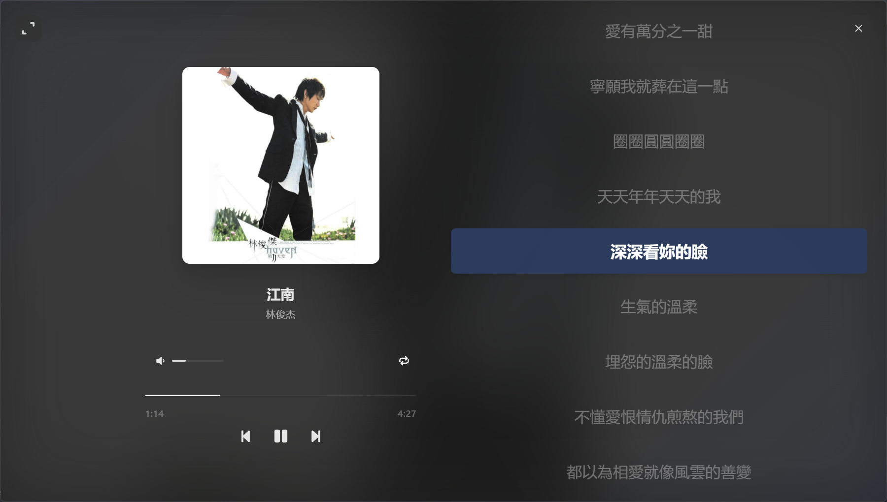

<br />
<p align="center">
  
  <h1 align="center" style="font-weight: 600">🎵 MusicBox</h1>
  <p align="center">
    高颜值的本地音乐播放器
    <br />
    <br />
    <!-- <a href="#-特性"><strong>✨ 查看特性</strong></a>&nbsp;&nbsp;|&nbsp;&nbsp; -->
    <a href="#-安装"><strong>📦 下载安装</strong></a>&nbsp;&nbsp;|&nbsp;&nbsp;
    <a href="#-开发"><strong>🛠️ 开发指南</strong></a>&nbsp;&nbsp;|&nbsp;&nbsp;
    <a href="#-相关截图"><strong>📌 相关截图</strong></a>
    <br />
  </p>
</p>

[](LICENSE)
[](#-安装)
[](https://electronjs.org/)
[](https://nodejs.org/)

---

## 📖 项目简介

**MusicBox**
是一款专注于本地音乐播放的桌面应用程序，采用现代化的技术栈和精美的用户界面设计。项目灵感来源于 [YesPlayMusic](https://github.com/qier222/YesPlayMusic)
的设计美学，致力于为用户提供优雅、流畅的本地音乐播放体验。

### 🎯 设计理念

- **高颜值界面**：参考 YesPlayMusic 的ui设计，提供简洁优雅的用户界面
- **本地优先**：专注于本地音乐文件播放
- **高性能音频**：基于 Web Audio API 的音频引擎，提供高质量音频播放
- **跨平台支持**：基于 Electron 框架，支持 Windows、macOS 和 Linux

## 📔 开发计划与TODO列表

### 🎯 项目状态概览（基于代码实际分析）
- **架构完成度**: 95% - Electron架构、IPC通信、Web Audio引擎完整实现
- **核心功能**: 85% - 音频播放、文件管理、缓存系统、播放列表管理已完成
- **用户界面**: 90% - 主界面、播放器、设置页面、歌词页面已完成
- **用户体验**: 75% - 基础交互、主题切换、快捷键、拖拽支持已实现

### ✅ 已完成的主要功能
- **完整的音频播放引擎**：Web Audio API实现，支持播放/暂停/跳转/音量控制
- **播放模式切换**：顺序播放、随机播放、单曲循环已实现
- **播放列表管理**：完整的播放队列、拖拽排序、添加/删除功能
- **音乐库管理**：目录扫描、元数据解析、缓存系统、搜索功能
- **用户界面组件**：播放器控件、进度条、音量控制、侧边栏导航
- **设置系统**：完整的设置页面，包括缓存管理、歌词目录设置
- **歌词功能**：本地歌词文件读取、LRC解析、歌词页面显示
- **主题系统**：明暗主题切换，状态持久化
- **文件操作**：拖拽导入、文件对话框、多格式音频支持
- **快捷键支持**：空格播放/暂停、Ctrl+左右切换歌曲等

### 📋 精准待办事项清单

#### 🔴 P0 - 关键Bug修复和功能完善 (最高优先级)
- [ ] **歌词同步显示** `预估: 2天`
  - [ ] 实现LRC歌词时间轴解析
  - [ ] 歌词滚动和当前行高亮
  - [ ] 歌词页面进度同步
  - **缺失点**: 歌词组件中缺少时间轴解析和同步逻辑

- [ ] **页面视图路由** `预估: 3天`
  - [ ] 实现首页内容展示
  - [ ] 艺术家页面数据展示
  - [ ] 收藏和最近播放页面
  - **缺失点**: Navigation组件中视图切换逻辑未完整实现

- [ ] **播放列表持久化** `预估: 1天`
  - [ ] 播放列表状态保存到本地存储
  - [ ] 应用重启后恢复播放列表
  - **缺失点**: 播放列表组件缺少持久化逻辑

#### 🟠 P1 - 用户体验优化 (高优先级)
- [ ] **封面获取优化** `预估: 2天`
  - [ ] 优化封面加载性能
  - [ ] 添加封面缓存机制
  - [ ] 支持更多封面来源
  - **缺失点**: Player组件中封面获取逻辑需要优化

- [ ] **错误处理完善** `预估: 2天`
  - [ ] 音频文件加载失败处理
  - [ ] 网络错误友好提示
  - [ ] 异常状态恢复机制
  - **缺失点**: 各组件缺少完整的错误处理

- [ ] **性能优化** `预估: 3天`
  - [ ] 大音乐库加载优化
  - [ ] 虚拟滚动实现
  - [ ] 内存使用优化
  - **缺失点**: TrackList组件需要虚拟滚动支持

#### 🟡 P2 - 功能扩展 (中优先级)
- [ ] **播放历史记录** `预估: 2天`
  - [ ] 播放历史数据收集
  - [ ] 最近播放页面实现
  - [ ] 播放统计功能
  - **缺失点**: 完全未实现

- [ ] **音频可视化** `预估: 4天`
  - [ ] 频谱分析器实现
  - [ ] 波形显示
  - [ ] 可视化效果配置
  - **缺失点**: 完全未实现

- [ ] **高级搜索** `预估: 2天`
  - [ ] 按艺术家、专辑、年份筛选
  - [ ] 搜索结果排序
  - [ ] 搜索建议功能
  - **缺失点**: Search组件功能较基础

#### 🟢 P3 - 高级特性 (低优先级)
- [ ] **桌面歌词** `预估: 3天`
  - [ ] 独立歌词窗口
  - [ ] 桌面歌词样式自定义
  - [ ] 歌词窗口置顶和透明度
  - **缺失点**: 完全未实现

- [ ] **音频处理** `预估: 4天`
  - [ ] 音频均衡器
  - [ ] 播放速度调节
  - [ ] 音频效果器
  - **缺失点**: Web Audio Engine缺少音频处理功能

- [ ] **插件系统** `预估: 5天`
  - [ ] 插件加载机制
  - [ ] 插件API设计
  - [ ] 插件管理界面
  - **缺失点**: 完全未实现

### 📊 开发里程碑（基于实际进度）

#### 🎯 里程碑 1: 核心功能完善 (预估完成时间: 1周)
- 修复歌词同步显示功能
- 完善页面视图路由系统
- 实现播放列表持久化
- **当前进度**: 85% → 95%

#### 🎯 里程碑 2: 用户体验优化 (预估完成时间: 2周)
- 优化封面获取和缓存
- 完善错误处理机制
- 实现性能优化
- **当前进度**: 75% → 90%

#### 🎯 里程碑 3: 功能扩展 (预估完成时间: 4周)
- 实现播放历史记录
- 添加音频可视化
- 完善高级搜索功能
- **当前进度**: 0% → 70%

#### 🎯 里程碑 4: 高级特性 (预估完成时间: 6周)
- 开发桌面歌词功能
- 实现音频处理功能
- 设计插件系统架构
- **当前进度**: 0% → 60%

### 🔧 代码质量和技术债务
- [ ] **单元测试**: 为核心组件添加测试用例
- [ ] **代码文档**: 完善JSDoc注释
- [ ] **性能监控**: 添加性能指标收集
- [ ] **错误日志**: 完善错误报告系统
- [ ] **代码规范**: 统一代码风格和命名规范

### 📈 当前开发重点（基于实际状态）
1. **立即开始**: 歌词同步显示功能（最影响用户体验）
2. **本周目标**: 完成P0级别的关键Bug修复
3. **本月目标**: 达成里程碑1和里程碑2的所有目标

### 🎉 项目亮点
- **高完成度**: 核心功能已基本实现，代码质量较高
- **现代架构**: 使用Web Audio API，避免了原生依赖问题
- **完整生态**: 从音频引擎到UI组件的完整实现
- **用户友好**: 支持拖拽、快捷键、主题切换等现代交互

## 📦 安装

### 预编译版本下载

前往 [Releases](https://github.com/asxez/MusicBox/releases) 页面下载适合你操作系统的安装包：

### 从源码构建

从源码构建 MusicBox，请按照以下步骤操作：

#### 1. 克隆仓库

```bash
git clone https://github.com/asxez/MusicBox.git
cd MusicBox
```

#### 2. 安装依赖

```bash
# 安装主项目依赖
npm install

# 安装渲染进程依赖
cd src/renderer
npm install
cd ../..
```

#### 3. 开发模式运行

```bash
npm run dev
# 或者
npm run dev:main
```

#### 4. 构建应用

```bash
# 构建当前平台版本
npm run build

# 构建所有平台版本
npm run build:all
```

## 🛠️ 开发

### 项目结构

```
MusicBox/
├── src/
│   ├── main/                   # 主进程代码
│   │   ├── main.js             # 主进程入口
│   │   ├── preload.js          # 预加载脚本
│   │   └── library-cache-manager.js  # 音乐库缓存管理
│   └── renderer/               # 渲染进程代码
│       ├── public/             # 静态资源
│       │   ├── index.html      # 主页面
│       │   ├── styles/         # 编译后的样式
│       │   ├── js/             # 编译后的脚本
│       │   └── assets/         # 图标、图片等资源
│       ├── src/                # 源代码
│       │   ├── js/             # JavaScript 源码
│       │   │   ├── app.js      # 应用主类
│       │   │   ├── api.js      # API 接口层
│       │   │   ├── components.js  # UI 组件
│       │   │   ├── web-audio-engine.js  # 音频引擎
│       │   │   └── utils.js    # 工具方法
│       │   ├── styles/         # SCSS 样式源码
│       │   │   └── main.scss   # 主样式文件
│       │   └── assets/         # 源资源文件
│       └── scripts/            # 构建脚本
├── docs/                       # 文档和图片
├── dist/                       # 构建输出目录
├── package.json               # 项目配置
└── README.md                  # 项目说明
```

### 开发环境设置

#### 1. 环境要求

- Node.js >= 20.0.0

#### 2. 克隆项目

```bash
git clone https://github.com/asxez/MusicBox.git
cd MusicBox
```

#### 3. 安装依赖

```bash
# 安装主项目依赖
npm install

# 安装渲染进程依赖
cd src/renderer
npm install
cd ../..
```

#### 4. 开发模式
```bash
# 运行 electron
npm run dev:main

# 仅启动渲染进程服务器
npm run dev:renderer
```

## 🤝 贡献

我们欢迎所有形式的贡献！无论是报告 bug、提出功能建议，还是提交代码改进。

## 📄 许可证

本项目基于 [MIT License](LICENSE) 开源协议。

## 🙏 致谢

- [YesPlayMusic](https://github.com/qier222/YesPlayMusic) - 设计灵感来源
- [Electron](https://electronjs.org/) - 跨平台桌面应用框架
- [LrcApi](https://github.com/HisAtri/LrcApi) - 提供相关接口
- [music-metadata](https://github.com/borewit/music-metadata) - 音频元数据解析
- 所有为项目做出贡献的开发者们

## 📌 相关截图






---

<p align="center">
  <strong>如果你喜欢这个项目，请给它一个 ⭐️</strong>
</p>
