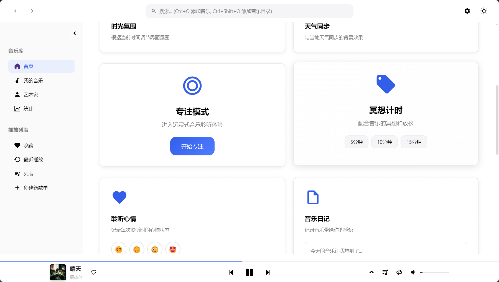
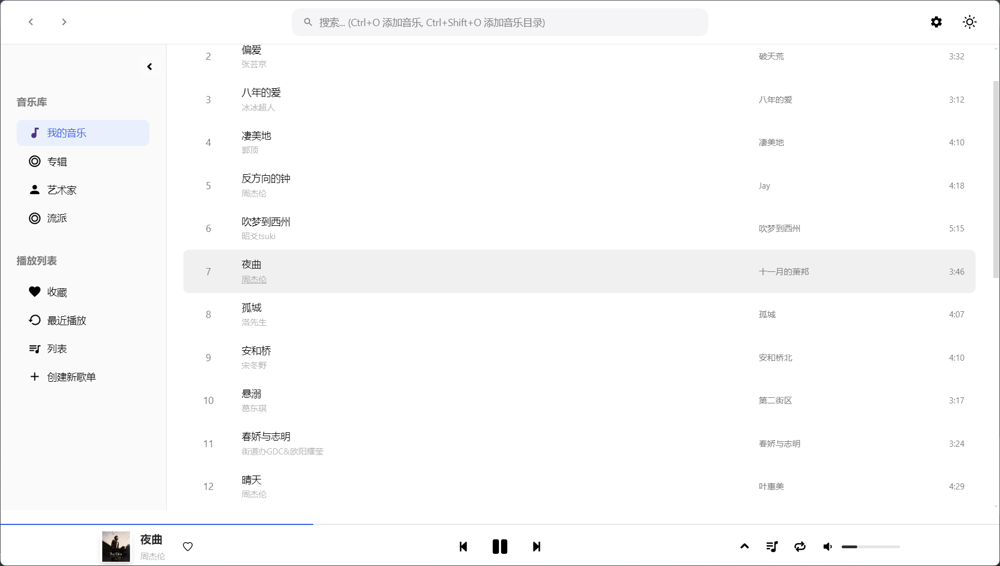
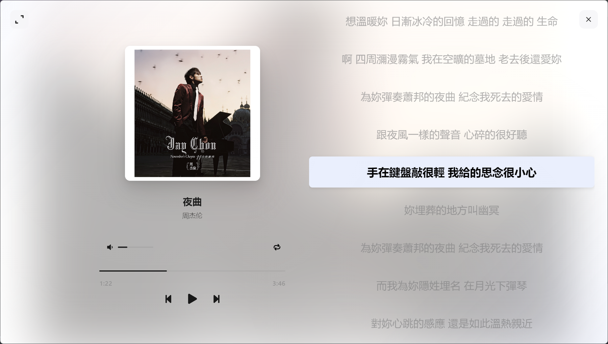
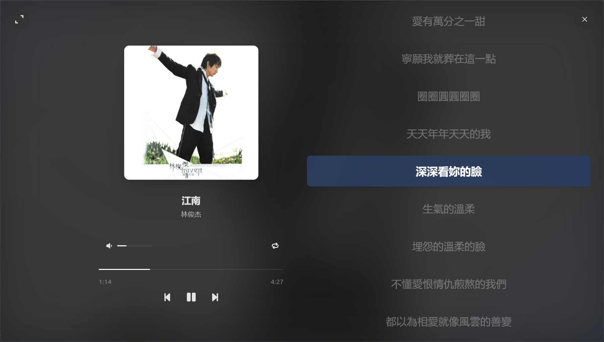

<br />
<p align="center">
  
  <h1 align="center" style="font-weight: 600">🎵 MusicBox</h1>
  <p align="center">
    高颜值的本地音乐播放器
    <br />
    <br />
    <!-- <a href="#-特性"><strong>✨ 查看特性</strong></a>&nbsp;&nbsp;|&nbsp;&nbsp; -->
    <a href="#-安装"><strong>📦 下载安装</strong></a>&nbsp;&nbsp;|&nbsp;&nbsp;
    <a href="#-开发"><strong>🛠️ 开发指南</strong></a>&nbsp;&nbsp;|&nbsp;&nbsp;
    <a href="#-相关截图"><strong>📌 相关截图</strong></a>
    <br />
  </p>
</p>

[](LICENSE)
[](#-安装)
[](https://electronjs.org/)
[](https://nodejs.org/)

---

## 📖 项目简介

- **MusicBox**是一款专注于本地音乐播放的桌面应用程序，采用现代化的技术栈和精美的用户界面设计。
- 项目灵感来源于 [YesPlayMusic](https://github.com/qier222/YesPlayMusic) 的设计美学。

## ✨ 特性
- ✅ 支持flac, mp3, wav, ogg, m4a, aac, wma等多种音乐格式
- 📔 支持在线获取歌曲封面和歌词
- ⌨️ 支持自定义局内/全局快捷键
- 🎈 浅色/深色主题切换
- 🎼 支持均衡器
- 💻 支持桌面显示歌词
- 📔 支持识别内嵌封面和内嵌歌词
- 👁️ 支持自由的页面显示开关
- 💾 支持挂载 SMB/WebDAV 等网络磁盘
- 🛠️ 更多特性开发中

## 📔 TODOS
✅已完成，❌未完成，🔄部分完成，❓待定

- ✅ 局内/全局快捷键
- 🔄 侧边导航栏页面
- ✅ 音乐变速不变调  （此功能在speed-feat分支中已实现，但是由于内存占用问题暂不合并到主分支）
- ✅ 均衡器
- 🔄 进一步完善设置功能
- ✅ 修复音乐文件元数据识别乱码
- ✅ 窗口管理
- ❌ 歌曲列表添加封面显示
- ❌ 歌词逐字
- ❌ MusicBox 实时状态接口
- ✅ SMB/WebDAV 等网络磁盘的挂载
- ❌ 更多快捷键支持（快进回退...）
- ❌ 修复播放列表存在的问题
- ❌ 歌词样式调整
- ✅ 桌面歌词显示
- ✅ 内嵌歌词识别
- ❌ 自定义音乐库歌曲信息
- ✅ 自定义歌单
- 🔄 更多其他特性


## 📦 安装

### 预编译版本下载

前往 [Releases](https://github.com/asxez/MusicBox/releases) 页面下载适合你操作系统的安装包，目前项目处于DEV阶段，仅提供Windows版本。

### 从源码构建

从源码构建 MusicBox，请按照以下步骤操作：

#### 1. 克隆仓库

```bash
git clone https://github.com/asxez/MusicBox.git
cd MusicBox
```

#### 2. 安装依赖

```bash
# 安装主项目依赖
npm install

# 安装渲染进程依赖
cd src/renderer
npm install
cd ../..
```

#### 3. 开发模式运行

```bash
npm run dev:main
```

#### 4. 构建应用

```bash
# 构建当前平台版本
npm run build

# 构建所有平台版本
npm run build:all
```

## 🛠️ 开发

### 项目结构

```
MusicBox/
├── src/
│   ├── main/                                   # 主进程代码
│   │   ├── main.js                             # 主进程入口
│   │   ├── preload.js                          # 预加载脚本
│   │   └── library-cache-manager.js            # 音乐库缓存管理
│   └── renderer/                               # 渲染进程代码
│       ├── src/                                # 源代码
│       │   ├── js/                             # JavaScript 源码
│       │   │   ├── components/                 # UI 组件
│       │   │   │   └── ...                     
│       │   │   ├── api.js                      # API 接口层
│       │   │   ├── app.js                      # 应用主类
│       │   │   ├── cache-manager.js            # localStorage缓存管理
│       │   │   ├── desktop-lyrics.js           # 桌面歌词管理
│       │   │   ├── embedded-lyrics-manager.js  # 内嵌歌词管理
│       │   │   ├── local-cover-manager.js      # 本地封面文件管理
│       │   │   ├── local-lyrics-manager.js     # 本地歌词文件管理
│       │   │   ├── md5.js                      # md5
│       │   │   ├── shortcut-config.js          # 快捷键配置
│       │   │   ├── shortcut-recorder.js        # 快捷键录制器
│       │   │   ├── utils.js                    # 工具方法
│       │   │   └── web-audio-engine.js         # 音频引擎
│       │   ├── styles/                         # SCSS 样式源码
│       │   │   └── main.scss                   # 主样式文件
│       │   └── assets/                         # 源资源文件
│       └── scripts/                            # 构建脚本
├── build/                                      # 构建的logo
├── docs/                                       # 文档和图片
├── dist/                                       # 构建输出目录
├── electron-builder.yml                        # 构建配置
├── package.json                                # 项目配置
└── README.md                                   # 项目说明
```

### 开发环境设置

#### 1. 环境要求

- Node.js >= 20.0.0

#### 2. 克隆项目

```bash
git clone https://github.com/asxez/MusicBox.git
cd MusicBox
```

#### 3. 安装依赖

```bash
# 安装主项目依赖
npm install

# 安装渲染进程依赖并构建渲染进程
cd src/renderer
npm install
npm run build
cd ../..
```

#### 4. 开发模式
```bash
# 运行 electron
npm run dev:main

# 仅启动渲染进程服务器
npm run dev:renderer
```

## 🤝 贡献

我们欢迎所有形式的贡献！无论是报告 bug、提出功能建议，还是提交代码改进。

## 📄 许可证

本项目基于 [MIT License](LICENSE) 开源协议。

## 🙏 致谢

- [YesPlayMusic](https://github.com/qier222/YesPlayMusic) - 设计灵感来源
- [Electron](https://electronjs.org/) - 跨平台桌面应用框架
- [LrcApi](https://github.com/HisAtri/LrcApi) - 提供相关接口
- [music-metadata](https://github.com/borewit/music-metadata) - 音频元数据解析
- 所有为项目做出贡献的开发者们

## 📌 相关截图








---

<p align="center">
  <strong>如果你喜欢这个项目，请给它一个 ⭐️</strong>
</p>
