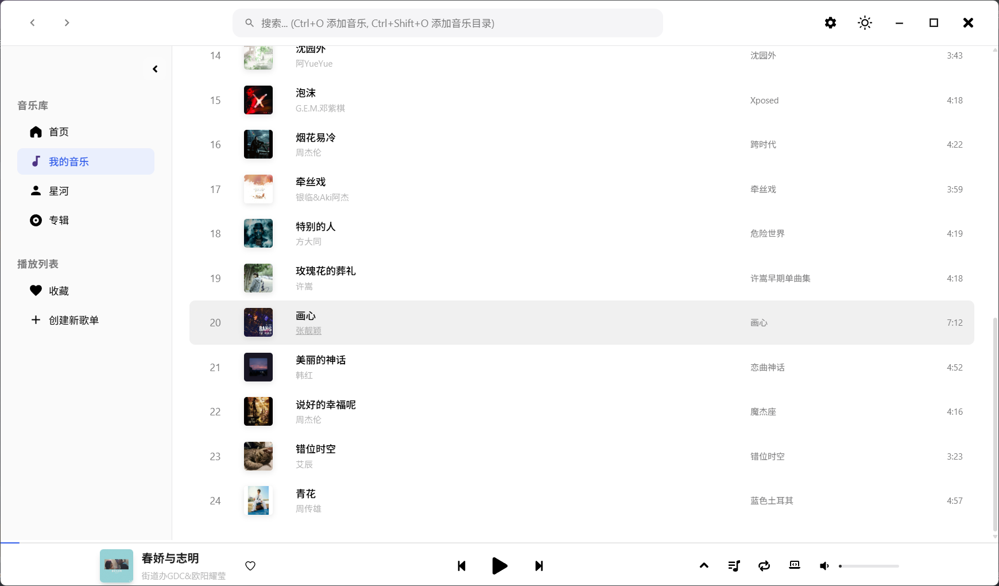
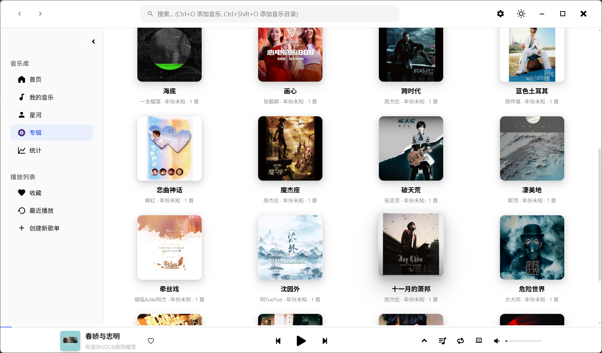
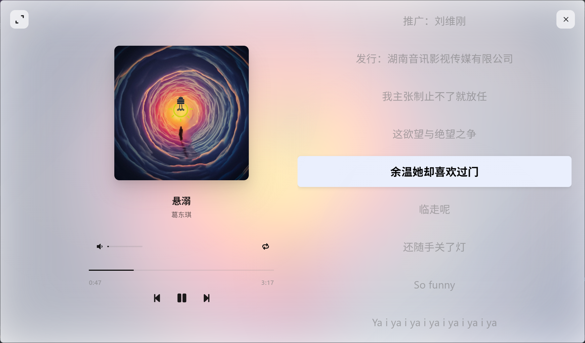
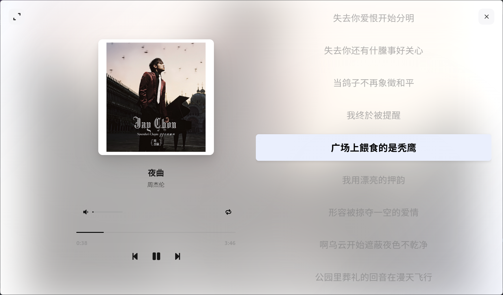

<br />
<p align="center">
  
  <h1 align="center" style="font-weight: 600">🎵 MusicBox</h1>
  <p align="center">
    高颜值的本地音乐播放器
    <br />
    <br />
    <a href="https://asxez.github.io/MusicBox/"><strong>🌐 官方网站</strong></a>&nbsp;&nbsp;|&nbsp;&nbsp;
    <a href="#-安装"><strong>📦下载安装</strong></a>&nbsp;&nbsp;|&nbsp;&nbsp;
    <a href="#-开发"><strong>🛠️开发指南</strong></a>&nbsp;&nbsp;|&nbsp;&nbsp;
    <a href="#-插件开发"><strong>🔧为MusicBox开发插件</strong></a>&nbsp;&nbsp;|&nbsp;&nbsp;
    <a href="#-相关截图"><strong>📌相关截图</strong></a>
    <br />
  </p>
</p>

[](https://deepwiki.com/asxez/MusicBox)
[](LICENSE)
[](#-安装)
[](https://electronjs.org/)
[](https://nodejs.org/)

---

## 📖 项目简介

- **MusicBox**是一款专注于本地音乐播放的桌面应用程序，采用现代化的技术栈和精美的用户界面设计。
- 项目灵感来源于 [YesPlayMusic](https://github.com/qier222/YesPlayMusic) 的设计美学。

## ✨ 特性

- 💻️ 支持 Windows / macOS / Linux
- ✅ 支持flac, mp3, wav, ogg, m4a, aac, wma等多种音乐格式
- 🔧 强大的插件系统
- 🎶 支持 WASAPI 音频独占模式
- 📔 支持在线获取歌曲封面和歌词
- ⌨️ 支持自定义局内/全局快捷键
- 🎈 浅色/深色主题切换
- 🎼 支持均衡器
- 📃 支持桌面显示歌词
- 📔 支持识别内嵌封面和内嵌歌词
- 👁️ 支持自由的页面显示开关
- 💾 支持挂载 SMB/WebDAV 等网络磁盘
- 🖋️ 支持编辑歌曲元数据
- ▶️ 支持无间隙播放，为连续的专辑歌曲提供更好的播放体验
- 🛠️ 更多特性开发中

## 📔 TODOS

✅已完成，❌未完成，🔄进行中，❓待定

- ✅ 硬件加速
- 🔄 重构插件系统
- ✅ 修复随机播放不随机的问题
- ❌ 歌词逐字
- ✅ WASAPI 音频独占模式
- ✅ 修复播放列表存在的问题
- 🔄 歌词样式调整
- ✅ 自动扫描
- ✅ 重构桌面歌词
- ✅ 修复添加网络磁盘后导航栏无法实时更新UI
- ✅ 改进网络磁盘显示
- ✅ 优化大批量音乐加载性能
- ✅ 改进优化统计页数据

## 📦 安装

### 预编译版本下载

前往 [Releases](https://github.com/asxez/MusicBox/releases) 页面下载适合你系统的安装包。

### 从源码构建

#### 环境要求

- Node.js >= 22.18.0
- Python >= 3.8
- Rust == 1.89.0

从源码构建 MusicBox，请按照以下步骤操作：

#### 1. 克隆仓库

```bash
git clone https://github.com/asxez/MusicBox.git
cd MusicBox
```

#### 2. 安装依赖

```bash
npm install
npm run install:renderer
npm run install:rs
pip install -r requirements.txt
```

#### 3. 开发模式运行

```bash
npm run dev
```

#### 4. 构建应用

```bash
# 构建当前平台版本
npm run build
```

## 🛠️ 开发

### 项目架构

见[MusicBox 架构文档](docs/Architecture.md)


## 🔧 插件开发

可在 **issue** 中提交你开发的插件，我会在此链接你的仓库😋

[MusicBox 插件文档](src/renderer/src/js/extensions/docs)


### 可用插件列表

内置插件：主题增强插件

## 🤝 贡献

我们欢迎所有形式的贡献！无论是报告 bug、提出功能建议、提交代码，或者说提交你开发的插件！

注意：日志输出请务必以相关 emoji 图标开头！（日志过多，便于快速查看）

## 📄 许可证

本项目基于 [MIT License](LICENSE) 开源协议。

## 🙏 致谢

- 所有为项目做出贡献的开发者们

## 📌 相关截图








---

<p align="center">
  <strong>如果你喜欢这个项目，请给它一个 ⭐️</strong>
</p>
